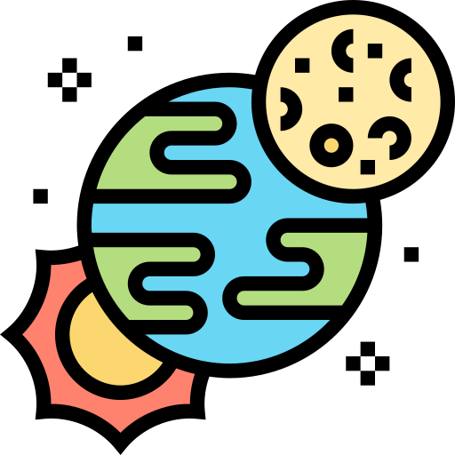

# Spacestagram
Webpage that can pull images from NASA's Astronomy API, and allow the user to “like” and “unlike” their favourite images. Try it out here 👉 [https://dlabbate-spacestagram.netlify.app/]

<br/>

## Tech Stack
### Frontend
  

### Testing
 

## Overview
This project pulls data from <a href="https://api.nasa.gov/#apod">Astronomy Picture of the Day (APOD)</a> 


## Responsive Masonry Layout
The fetched data is displayed in a responsive "masonry" layout.


## Google Lighthouse Scores


## Extras

### Select a Date Range


### Likes Saved to Local Storage


### Lazy Loading Images


### Heartbeat Animation (On Hover)


### URL Link


### Testing
I implemented some unit tests using `jest` and `react-testing-library`. An example outlined below:

```javascript
const date = new Date(2021, 3, 17);

test("date is formatted in YYYY-MM-DD", () => {
  const formattedDate = formatDate(date);
  expect(formattedDate).toBe("2021-04-17");
});
```

Note that the testing in this project is not comprehensive, but a work in progress that I would like to continue improving!

## References
* <a href="https://www.flaticon.com/">Icons made by Flaticon</a>
